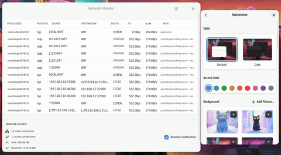

# Network Monitor



A real-time network connection monitoring tool built with Rust and GTK4, displaying active connections with live I/O statistics in a modern graphical interface. **Now supports both Linux and macOS!**

## Features

- **Real-time monitoring**: Continuously monitors active network connections
- **I/O statistics**: Shows live upload/download rates for each connection
- **Process identification**: Displays the program and PID associated with each connection
- **Modern GTK4 UI**: Clean, responsive graphical interface with Libadwaita styling
- **Address resolution**: Simplifies common addresses (localhost, any, mDNS)
- **Connection filtering**: Filters out localhost connections for cleaner output

## Requirements

- Rust 1.70+ (2021 edition)
- GTK4 development libraries
- Libadwaita development libraries

### Linux Requirements
- Linux system with `/proc` filesystem
- `ss` command (usually from iproute2 package)

### macOS Requirements
- macOS 10.15 or later
- `lsof` command (pre-installed on macOS)

### Installation on Ubuntu/Debian:
```bash
sudo apt update
sudo apt install libgtk-4-dev libadwaita-1-dev
```

### Installation on Fedora:
```bash
sudo dnf install gtk4-devel libadwaita-devel
```

### Installation on macOS:
```bash
# Install Homebrew if not already installed
# /bin/bash -c "$(curl -fsSL https://raw.githubusercontent.com/Homebrew/install/HEAD/install.sh)"

brew install gtk4 libadwaita
```

**Quick Start on macOS:**
```bash
# Use the provided build script
chmod +x build-macos.sh
./build-macos.sh
```

**Manual Build on macOS:**
```bash
# Set PKG_CONFIG_PATH to find GTK4 libraries
export PKG_CONFIG_PATH="/usr/local/opt/gtk4/lib/pkgconfig:/usr/local/opt/libadwaita/lib/pkgconfig:$PKG_CONFIG_PATH"

# Build the project
cargo build --release
```

## Installation

1. Clone the repository:
```bash
git clone <repository-url>
cd network-monitor
```

2. Build and run:
```bash
cargo run
```

Or build in release mode:
```bash
cargo build --release
./target/release/network-monitor
```

## Usage

Launch the network monitor application:
```bash
cargo run
```

The application will open a GTK4 window displaying:
- **Protocol**: TCP/UDP protocol
- **State**: Connection state (ESTABLISHED, LISTEN, etc.)
- **Local Address**: Local endpoint (resolved to readable format)
- **Remote Address**: Remote endpoint (resolved to readable format)
- **Program(PID)**: Process name and PID
- **RX Rate**: Download rate
- **TX Rate**: Upload rate

### Address Resolution

Common addresses are simplified for readability:
- `0.0.0.0:*` or `*:*` → `ANY`
- `127.0.0.1:*` or `[::1]:*` → `LOCALHOST`
- `224.0.0.251:*` → `MDNS`

## How It Works

### Linux
1. Uses `ss -tulnape` to get active connections with process information
2. Reads `/proc/[pid]/io` for real-time I/O statistics
3. Calculates rates by comparing I/O between updates
4. Updates GTK4 interface every second with current connection state

### macOS
1. Uses `lsof -i -n -P` to get active network connections
2. Parses lsof output for process information and connection details
3. Uses `ps` command for additional process information
4. Updates GTK4 interface every second with current connection state

**Note:** I/O rate statistics on macOS are currently limited compared to Linux due to platform API differences.

## Architecture

- **GTK4**: Modern cross-platform GUI framework
- **Libadwaita**: GNOME-style UI components
- **Tokio**: Async runtime for concurrent operations
- **System calls**: Direct interaction with `/proc` filesystem

## License

This project is open source. See the LICENSE file for details.