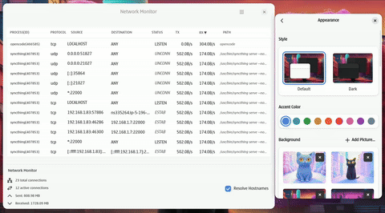
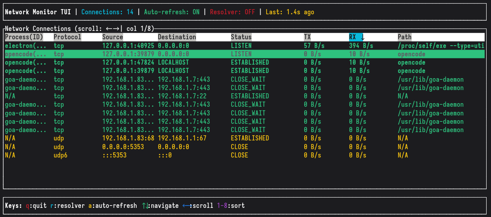

# Network Monitor



A real-time network connection monitoring tool built with Rust and GTK4, displaying active connections with live I/O statistics in a modern graphical interface.

[](https://github.com/grigio/network-monitor/actions/workflows/rust.yml)
[](https://deps.rs/repo/github/grigio/network-monitor)


## Features

- **Real-time monitoring**: Continuously monitors active network connections
- **I/O statistics**: Shows live upload/download rates for each connection
- **Process identification**: Displays the program and PID associated with each connection
- **Modern GTK4 UI**: Clean, responsive graphical interface with Libadwaita styling
- **Terminal UI (TUI)**: Interactive terminal interface with the same monitoring capabilities
- **Address resolution**: Simplifies common addresses (localhost, any, mDNS)
- **Connection filtering**: Filters out localhost connections for cleaner output
- **GNOME integration**: Proper WM class support for dock pinning and desktop integration
- **Dual installation**: Supports both user-local and system-wide installation
- **Robust error handling**: Comprehensive error recovery with clear setup guidance
- **Performance optimized**: Process caching and layout caching for improved responsiveness

## Requirements

- Rust 1.70+ (2021 edition)
- GTK4 development libraries
- Libadwaita development libraries
- Linux system with `/proc` filesystem
- Linux 5.8+ (for eBPF granular capabilities)
- Nightly Rust and `bpf-linker` (for eBPF compilation)

### Installation on Ubuntu/Debian:
```bash
sudo apt update
sudo apt install libgtk-4-dev libadwaita-1-dev
```

### Installation on Fedora:
```bash
sudo dnf install gtk4-devel libadwaita-devel
```

## Installation

### Method 1: Install from source with desktop integration

1. Clone the repository:
```bash
git clone <repository-url>
cd network-monitor
```

2. Install locally (no sudo required):
```bash
./scripts/install.sh
```

3. Or install system-wide (requires sudo):
```bash
sudo ./scripts/install.sh
```

The installation script will:
- Build both GTK4 and TUI binaries (debug for local, release for system-wide)
- Install binaries to `~/.local/bin/` (local) or `/usr/local/bin/` (system-wide)
- Install desktop file with proper WM class for GNOME dock pinning
- Install icons to appropriate icon directories
- Update icon cache and desktop database
- Ensure the application can be pinned to GNOME dock/dashboard

### Method 2: Build and run directly

1. Clone the repository:
```bash
git clone <repository-url>
cd network-monitor
```

2. Build and run:
```bash
cargo run
```

Or build in release mode:
```bash
cargo build --release
./target/release/network-monitor
```

### Method 3: Build and run the TUI version

1. Clone the repository:
```bash
git clone <repository-url>
cd network-monitor
```

2. Build and run the TUI:
```bash
cargo build --bin nmt
./target/debug/nmt
```

Or build in release mode:
```bash
cargo build --release --bin nmt
./target/release/nmt
```

## Uninstallation

### Remove installed version

Local installation removal:
```bash
./scripts/uninstall.sh
```

System-wide removal (requires sudo):
```bash
sudo ./scripts/uninstall.sh
```

The uninstallation script will remove the binary, desktop file, and icons from the appropriate locations and update all relevant caches.

## Usage

### GTK4 Graphical Interface

Launch the network monitor application:
```bash
cargo run
```

The application will open a GTK4 window displaying:
- **Process(ID)**: Process name and PID with accurate socket-to-process mapping
- **Protocol**: TCP/UDP protocol
- **Source**: Local endpoint (resolved to readable format)
- **Destination**: Remote endpoint (resolved to readable format)
- **Status**: Connection state (ESTABLISHED, LISTEN, etc.)
- **TX**: Upload rate calculated from process I/O statistics
- **RX**: Download rate calculated from process I/O statistics
- **Path**: Full command path and arguments from `/proc/[pid]/cmdline`

### Terminal Interface (TUI)



Launch the terminal interface:
```bash
cargo run --bin nmt
```

The TUI provides the same monitoring capabilities in an interactive terminal interface:

**Key Controls:**
- `q` - Quit the application
- `r` - Manually refresh connections
- `a` - Toggle auto-refresh (2-second intervals)
- `↑/↓` - Navigate through connections
- `←/→` - Scroll table horizontally
- `1-8` - Sort by columns (Process(ID), Protocol, Source, Destination, Status, TX, RX, Path)

**Features:**
- Real-time connection monitoring with auto-refresh
- Sortable columns with visual indicators
- Horizontal scrolling for wide tables
- Smart column sizing - last column gets full remaining width
- Color-coded protocols (TCP/TCP6 in green, UDP/UDP6 in yellow)
- Active connection highlighting
- Process and PID information
- Live I/O rate display
- Same column order as GTK4 version for consistency

### Address Resolution

Common addresses are simplified for readability:
- `0.0.0.0:*` or `*:*` → `ANY`
- `127.0.0.1:*` or `[::1]:*` → `LOCALHOST`
- `224.0.0.251:*` → `MDNS`

## How It Works

### eBPF Backend (event-driven)

The app uses kernel-level kprobes (`tcp_v4_connect`, `tcp_v6_connect`, `tcp_close`,
`inet_csk_accept`) instead of polling `/proc/net`. This provides:

- **Event-driven**: Sub-millisecond event delivery, no polling overhead (~1-3% CPU)
- **Direct PID**: Captured at probe point via `bpf_get_current_pid_tgid()`, no inode scanning
- **Short-lived connections**: Never missed between poll intervals

### eBPF Mode

The eBPF backend provides **event-driven** connection monitoring with lower overhead and real-time
events, compared to the default `/proc/net` polling approach. It can capture short-lived connections
that polling might miss.

**Prerequisites:**
```bash
rustup toolchain install nightly
cargo install bpf-linker
```

**Build and run:**
```bash
cargo build
```

**Run as normal user** (kernel 5.8+ required):

Grant the required Linux capabilities to the binary once:
```bash
sudo setcap cap_bpf,cap_net_admin,cap_perfmon+ep target/debug/network-monitor
./target/debug/network-monitor
```

Or for the TUI version:
```bash
sudo setcap cap_bpf,cap_net_admin,cap_perfmon+ep target/debug/nmt
./target/debug/nmt
```

For release builds, adjust the path accordingly:
```bash
sudo setcap cap_bpf,cap_net_admin,cap_perfmon+ep target/release/network-monitor
```

The app will exit with a setup message if eBPF is unavailable (missing capabilities or
unsupported kernel).

## Architecture
- **GTK4**: Modern cross-platform GUI framework
- **Libadwaita**: GNOME-style UI components
- **Tokio**: Async runtime for concurrent operations
- **Aya + eBPF**: Kernel-level connection tracing with kprobes for real-time events
- **Direct PID**: Process identification via `bpf_get_current_pid_tgid()` at the probe point
- **System calls**: Direct `/proc/[pid]/io` reading for I/O statistics
- **Error handling**: Comprehensive error types with graceful recovery using `thiserror`
- **Performance caching**: UI layout caching for optimal performance

## Linux Packages

[](https://repology.org/project/network-monitor/versions)


## Donations

If you find this project helpful, please consider making a donation to support its development.

- **Monero**: `88LyqYXn4LdCVDtPWKuton9hJwbo8ZduNEGuARHGdeSJ79BBYWGpMQR8VGWxGDKtTLLM6E9MJm8RvW9VMUgCcSXu19L9FSv`
- **Bitcoin**: `bc1q6mh77hfv8x8pa0clzskw6ndysujmr78j6se025`

## License

This project is open source. See the LICENSE file for details.
